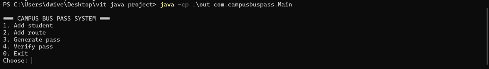
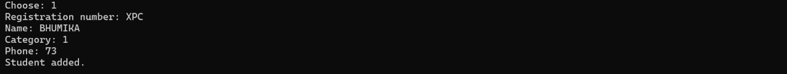
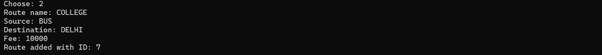
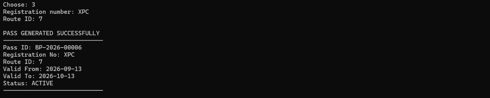
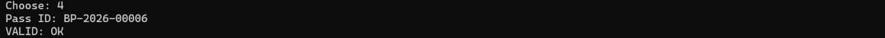

# Campus Bus Pass Management System using Java

A Core Java console application for managing students, campus bus routes, bus-pass generation, and pass verification.

---

## Table of Contents

| | |
|---|---|
| [1. Project Overview](#1-project-overview) | [13. Setup and Execution](#13-setup-and-execution) |
| [2. Problem Statement](#2-problem-statement) | [14. CLI Usage](#14-cli-usage) |
| [3. Objectives](#3-objectives) | [15. Input Validation](#15-input-validation) |
| [4. Scope and Target Users](#4-scope-and-target-users) | [16. Testing](#16-testing) |
| [5. Features](#5-features) | [17. Screenshots](#17-screenshots) |
| [6. Functional Requirements](#6-functional-requirements) | [18. Design Decisions](#18-design-decisions) |
| [7. Non-Functional Requirements](#7-non-functional-requirements) | [19. Challenges Faced](#19-challenges-faced) |
| [8. Technologies and Java Concepts](#8-technologies-and-java-concepts) | [20. Limitations and Future Enhancements](#20-limitations-and-future-enhancements) |
| [9. Dependencies and Configuration](#9-dependencies-and-configuration) | [21. GitHub and Version Control](#21-github-and-version-control) |
| [10. Project Structure](#10-project-structure) | [22. VITyarthi Documentation](#22-vityarthi-documentation) |
| [11. Architecture](#11-architecture) | [23. Academic Information](#23-academic-information) |
| [12. Main Menu](#12-main-menu) | [24. Conclusion](#24-conclusion) |
| | [License](#license) |

---

## 1. Project Overview

The **Campus Bus Pass Management System** provides a structured console-based solution for campus transportation management.

The system allows authorized users to:

- Add student information
- Add campus bus routes
- Generate unique bus passes
- Associate passes with students and routes
- Assign pass validity dates
- Verify bus passes
- Validate user input

The project demonstrates Core Java, object-oriented programming, modular design, packages, collections, date/time handling, exception handling, and Git-based version control.

---

## 2. Problem Statement

Manual campus bus-pass management can be time-consuming and may lead to errors when maintaining student details, routes, pass IDs, validity dates, and verification information.

This project provides a Java-based console solution for managing these activities through separate application components.

---

## 3. Objectives

- Manage student information.
- Manage campus bus routes.
- Generate unique bus-pass IDs.
- Assign validity periods to passes.
- Verify pass validity.
- Validate user input and invalid operations.
- Demonstrate Core Java and object-oriented programming.
- Apply modular software design.

---

## 4. Scope and Target Users

### Scope

The current implementation covers:

- Student management
- Route management
- Bus-pass generation
- Pass validity management
- Pass verification
- Duplicate-student detection
- Student and route existence validation
- Unique pass-ID generation
- Application data management through the project's data/storage components

The application is currently command-line based.

### Target Users

- Campus transportation administrators
- College/university transportation staff
- Staff responsible for issuing bus passes
- Authorized personnel checking pass validity

---

## 5. Features

### Student Management

- Add registration number, name, category, and phone number.
- Detect duplicate registration numbers.

### Route Management

- Add route name, source, destination, and fee.
- Generate route IDs.

### Bus-Pass Management

- Select an existing student and route.
- Generate a unique pass ID.
- Assign validity dates.
- Use the configured route fee.
- Maintain pass status.

### Pass Verification

- Enter a pass ID.
- Find the corresponding pass.
- Check its validity.
- Display the verification result.

Example:

```text
Enter Pass ID: BP-2026-00004

VALID: OK
```

---

## 6. Functional Requirements

| ID | Requirement |
|---|---|
| FR-01 | Add and manage student information. |
| FR-02 | Add and manage campus bus routes. |
| FR-03 | Generate unique bus passes for existing students and routes. |
| FR-04 | Assign validity dates and status to generated passes. |
| FR-05 | Verify bus-pass validity using a pass ID. |
| FR-06 | Validate numeric input and invalid operations. |

### Pass Generation Workflow

1. Enter student registration number.
2. Enter route ID.
3. Verify that the student exists.
4. Verify that the route exists.
5. Obtain the configured route fee.
6. Generate a unique pass ID.
7. Assign the validity period.
8. Create the pass.
9. Store it through the application's data-access components.
10. Display the generated pass details.

---

## 7. Non-Functional Requirements

The project addresses:

- **Usability:** Simple menu-driven console interface.
- **Maintainability:** Separate model, DAO, service, data/storage, and utility components.
- **Reliability:** Validation of duplicate students, student/route existence, dates, and user input.
- **Error Handling:** Invalid input is handled through validation and exception-based mechanisms where appropriate.
- **Modularity:** Responsibilities are separated across multiple classes and packages.
- **Resource Efficiency:** Lightweight Core Java console application without a web/application server.

---

## 8. Technologies and Java Concepts

| Technology / Concept | Usage |
|---|---|
| Java / Core Java | Application development |
| Java Collections | Managing application objects |
| `LocalDate` | Pass validity dates |
| Exception Handling | Validation and error handling |
| Packages & Classes | Modular structure |
| Visual Studio Code | Development |
| PowerShell | Compilation and execution |
| Git | Version control |
| GitHub | Repository hosting |

---

## 9. Dependencies and Configuration

The project is a Core Java application and does not use Maven or Gradle.

No external framework, API key, environment variable, or external database server is required for normal execution.

### Requirements

- JDK 25 or compatible JDK
- PowerShell or another terminal
- Visual Studio Code is recommended for development

Verify Java:

```powershell
javac -version
```

Example:

```text
javac 25.0.4
```

---

## 10. Project Structure

```text
Campus-Bus-Pass-Management-System/
│
├── .vscode/
├── src/
│   └── com/
│       └── campusbuspass/
│           ├── Main.java
│           │
│           ├── dao/
│           │   ├── PassDAO.java
│           │   ├── RouteDAO.java
│           │   ├── StudentDAO.java
│           │   └── VerificationLogDAO.java
│           │
│           ├── db/
│           │   ├── DB.java
│           │   └── Schema.java
│           │
│           ├── model/
│           │   ├── Pass.java
│           │   ├── Route.java
│           │   ├── Student.java
│           │   └── VerificationLog.java
│           │
│           ├── service/
│           │   ├── PassIdGenerator.java
│           │   ├── PassService.java
│           │   └── VerificationService.java
│           │
│           └── util/
│               └── Input.java
│
├── screenshots/
│   ├── add-route.png
│   ├── add-student.png
│   ├── generate-pass.png
│   ├── main-menu.png
│   └── verify-pass.png
│
├── report/
│   └── Campus_Bus_Pass_Management_System_Final_Report.docx
│
├── TERMINAL OUTPUT/
│   └── terminal output.pdf
│
├── .gitignore
├── README.md
└── statement.md
```

The `out/` directory is generated locally during compilation and is excluded from Git.

The local `campus_bus_passes.dat` file is ignored by Git and is not part of the tracked repository contents.

---

## 11. Architecture

The application uses a modular layered structure:

```text
                 +----------------------+
                 |        Main          |
                 |   Console Interface  |
                 +----------+-----------+
                            |
                            v
                 +----------------------+
                 |     Service Layer    |
                 |                      |
                 | PassService          |
                 | VerificationService  |
                 | PassIdGenerator      |
                 +----------+-----------+
                            |
                            v
                 +----------------------+
                 |       DAO Layer      |
                 |                      |
                 | StudentDAO           |
                 | RouteDAO             |
                 | PassDAO              |
                 | VerificationLogDAO   |
                 +----------+-----------+
                            |
                            v
                 +----------------------+
                 |  Data/Storage Layer  |
                 | DB / Schema           |
                 +----------------------+

               Model Layer:
        Student | Route | Pass | Log
```

### Main Components

**Model**

- `Student`
- `Route`
- `Pass`
- `VerificationLog`

**DAO**

- `StudentDAO`
- `RouteDAO`
- `PassDAO`
- `VerificationLogDAO`

**Service**

- `PassService`
- `VerificationService`
- `PassIdGenerator`

**Data/Storage**

- `DB`
- `Schema`

**Utility**

- `Input`

---

## 12. Main Menu

```text
=== CAMPUS BUS PASS SYSTEM ===
1. Add student
2. Add route
3. Generate pass
4. Verify pass
0. Exit
Choose:
```

| Option | Function |
|---|---|
| `1` | Add student |
| `2` | Add route |
| `3` | Generate pass |
| `4` | Verify pass |
| `0` | Exit |

---

## 13. Setup and Execution

### Clone Repository

```powershell
git clone https://github.com/parasdwivedi26/Campus-Bus-Pass-Management-System.git
cd Campus-Bus-Pass-Management-System
```

### Verify Java

```powershell
javac -version
```

### Compile

From the project root:

```powershell
Remove-Item -Recurse -Force .\out -ErrorAction SilentlyContinue
New-Item -ItemType Directory -Force .\out
javac -d .\out (Get-ChildItem -Recurse .\src -Filter *.java).FullName
```

If no compiler errors are displayed, compilation is successful.

### Run

```powershell
java -cp .\out com.campusbuspass.Main
```

The application starts with the main menu shown above.

---

## 14. CLI Usage

### Add Student

Select:

```text
1
```

Enter:

```text
Registration number:
Name:
Category:
Phone:
```

Example:

```text
Registration number: XPB
Name: BHUMI
Category: 1
Phone: 9898
```

Duplicate registration numbers are rejected.

### Add Route

Select:

```text
2
```

Enter:

```text
Route name:
Source:
Destination:
Fee:
```

Example:

```text
Route name: COLLEGE
Source: BUS
Destination: BHOPAL
Fee: 500
```

Example result:

```text
Route added with ID: 4
```

### Generate Pass

Select:

```text
3
```

Enter the student registration number and route ID:

```text
Registration number: XPB
Route ID: 4
```

Example output:

```text
PASS GENERATED SUCCESSFULLY
----------------------------
Pass ID: BP-2026-00001
Registration No: XPB
Route ID: 4
Valid From: 2026-09-13
Valid To: 2026-10-13
Status: ACTIVE
----------------------------
```

Pass IDs follow the format:

```text
BP-YEAR-SERIAL
```

Example:

```text
BP-2026-00004
```

The current implementation generates a monthly validity period.

### Verify Pass

Select:

```text
4
```

Enter the generated pass ID:

```text
Pass ID: BP-2026-00001
```

Valid result:

```text
VALID: OK
```

If the pass cannot be found:

```text
INVALID: Pass not found
```

---

## 15. Input Validation

The application validates important user inputs and operations.

Examples include:

- Duplicate student registration number
- Student existence before pass generation
- Route existence before pass generation
- Invalid numeric input
- Invalid pass validity date range

Example invalid numeric input:

```text
Route ID: COLLEGE
Enter a valid integer.
Route ID:
```

---

## 16. Testing

Testing was performed through command-line execution.

| Test Case | Action | Expected Result |
|---|---|---|
| Add student | Valid student information | Student added |
| Add duplicate student | Existing registration number | `Student already exists` |
| Add route | Valid route information | Route added with ID |
| Generate pass | Valid registration number + route ID | Pass generated |
| Verify valid pass | Correct pass ID | `VALID: OK` |
| Verify invalid pass | Incorrect/nonexistent pass ID | Invalid/not-found result |
| Invalid numeric input | Text instead of integer | `Enter a valid integer.` |
| Exit | `0` | Application exits |

### Testing Evidence

The demonstrated test workflow included:

```text
Add Student
     ↓
Student Added
     ↓
Add Route
     ↓
Route Added
     ↓
Generate Pass
     ↓
Pass Generated
     ↓
Verify Pass
     ↓
VALID: OK
```

Tested generated pass IDs included:

```text
BP-2026-00003
BP-2026-00004
```

The terminal testing evidence is also included in:

```text
TERMINAL OUTPUT/terminal output.pdf
```

---

## 17. Screenshots

The repository contains five screenshots demonstrating the application's main operations.

### Main Menu



### Add Student



### Add Route



### Generate Pass



### Verify Pass



---

## 18. Design Decisions

### Modular Architecture

The project separates models, services, DAOs, storage-related components, and utilities to keep responsibilities organized.

### Service Layer

Business logic such as pass generation and verification is separated from the console interface.

### DAO Layer

Data-access operations are separated into dedicated DAO classes.

### Model Classes

Separate `Student`, `Route`, `Pass`, and `VerificationLog` classes represent the application's main entities.

### LocalDate

`LocalDate` is used for pass validity dates.

### Input Validation

Validation reduces errors caused by invalid input and invalid application operations.

---

## 19. Challenges Faced

The main development challenges included:

- Handling invalid command-line input.
- Validating student and route existence before pass generation.
- Generating unique pass IDs.
- Maintaining valid pass date ranges.
- Organizing the application into separate functional components.

---

## 20. Limitations and Future Enhancements

### Current Limitations

- Console-based interface
- No graphical user interface
- No web interface
- No advanced authentication
- No online payment
- No QR-code-based verification
- Limited reporting functionality

### Future Enhancements

Possible future improvements include:

- Relational database integration
- Student and administrator authentication
- Pass renewal
- Pass blocking/unblocking
- QR-code verification
- Digital bus passes
- Online payment
- Route schedules
- Search and filtering
- GUI, web, or mobile application
- Reports and analytics

---

## 21. GitHub and Version Control

The project uses Git for version control and GitHub for repository hosting.

**Repository:**

https://github.com/parasdwivedi26/Campus-Bus-Pass-Management-System

The repository contains:

- Complete Java source code
- `README.md`
- `statement.md`
- Screenshots
- Project report
- Terminal testing evidence
- `.gitignore`

Generated compilation output and local runtime data are excluded from Git.

---

## 22. VITyarthi Documentation

The project includes the required project statement:

```text
statement.md
```

It covers:

- Problem statement
- Scope
- Target users
- High-level features

The project report is maintained under:

```text
report/
```

The report contains the project description, requirements, architecture/design information, implementation details, testing evidence, challenges, learnings, limitations, and future enhancements.

For final portal submission, the report should be provided in the format required by the VITyarthi instructions.

---

## 23. Academic Information

| Field | Details |
|---|---|
| Project Title | Campus Bus Pass Management System using Java |
| Student | Paras Dwivedi |
| Registration No. | 25BAI10621 |
| Programming Language | Java |
| Application Type | Console-Based Application |
| Development Environment | Visual Studio Code |
| Version Control | Git / GitHub |
| Academic Project | VITyarthi Project |

---

## 24. Conclusion

The **Campus Bus Pass Management System** demonstrates a modular Core Java approach to managing campus transportation passes.

The system supports student management, route management, bus-pass generation, pass validity, pass verification, and input validation.

Its separation into model, DAO, service, data/storage, and utility components provides a structured foundation for future enhancements such as database integration, authentication, QR-code verification, and graphical or web-based interfaces.

---

## License

This project was developed as an academic project for educational purposes.
